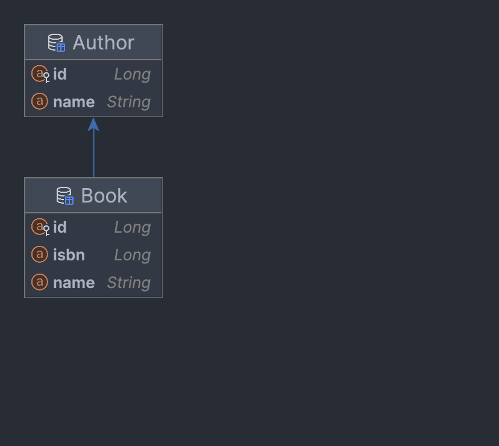

# Library test task - тестовое задание

### Задача:

Реализовать REST API для ведения базы книг и их авторов.

### Необходимо:

1. Описать доменную модель
2. Спроектировать REST API для работы с книгами и авторами:
   1. Добавление новой книги
   2. Изменение информации о книге включая авторов
   3. Удаление книги
   4. Получение списка книг с фильтрацией по наименованию, ISBN, автору
   5. Добавление автора без привязки к книге
   6. Изменение данных автора
   7. Удаление автора
   8. Получение списка авторов
3. Реализовать приложение на SpringBoot

### Используемые технологии и фреймворки:

Язык программирования – Java.

Фреймворки – Spring Boot, ORM Hibernate

СУДБ – любая реляционная, предпочтительно PostgreSQL

### Ожидания от тестового задания:

1. Оформлено в виде docker-контейнера и сопровождается docker-compose файлом для      быстрого запуска
2. Засечено время работы над задачей по пунктам:
   1. Проектирование модели данных
   2. Реализация

---

### Демо:
* [Swagger](http://nr.ddns.ms:8013/swagger-ui/index.html)
* [Backend base path - http://nr.ddns.ms:8013](http://nr.ddns.ms:8013)

---
Спецификация API: [Swagger](swagger/LibraryTestTask.json)
Тестирование Endpoints: [Postman](postman/LibraryTestTask.json)

### Схема базы данных


---

### Стек технологий

* Java 17
* Spring Boot 3.1
* Hibernate
* PostgreSQL
* H2
* Maven
* Docker Compose
* Lombok
* MapStruct
* Postman

---

### Запуск приложения

Потребуется Java 17, Docker, Git, Apache Maven

1. Склонировать

```shell
git clone https://github.com/Azark1n/LibraryTestTask
```

2. Собрать проект

```shell
mvn clean package
```

3. Запустить через Docker Compose

```shell
docker compose up
```
